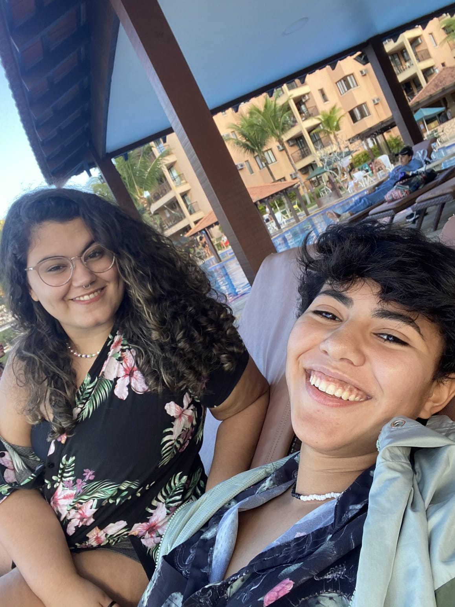
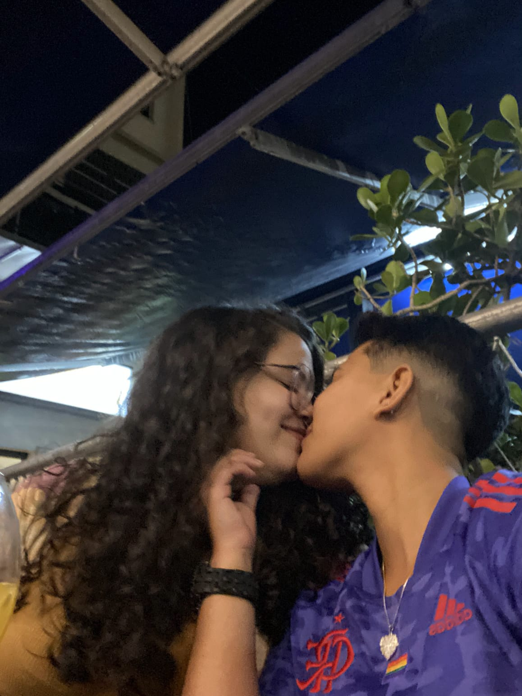
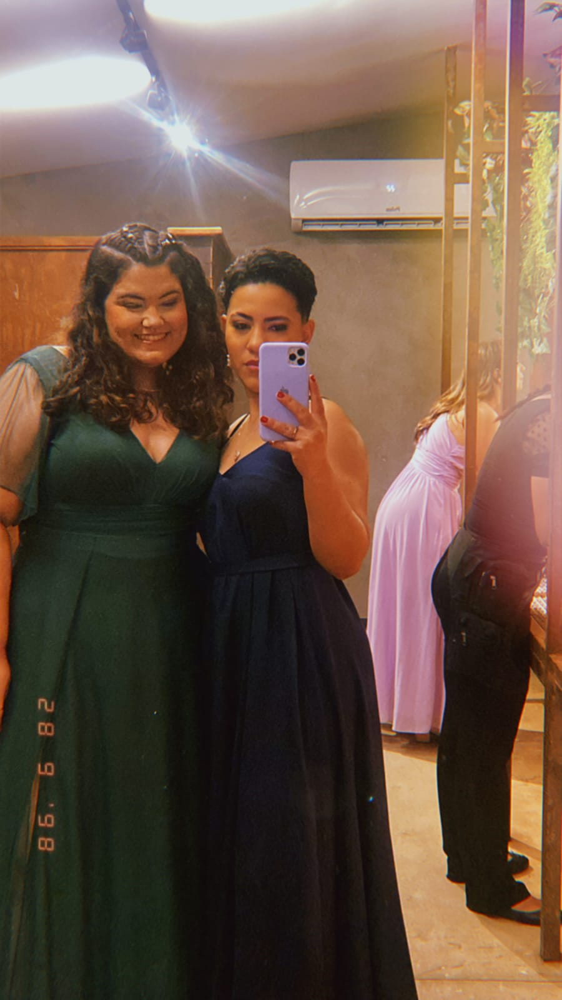
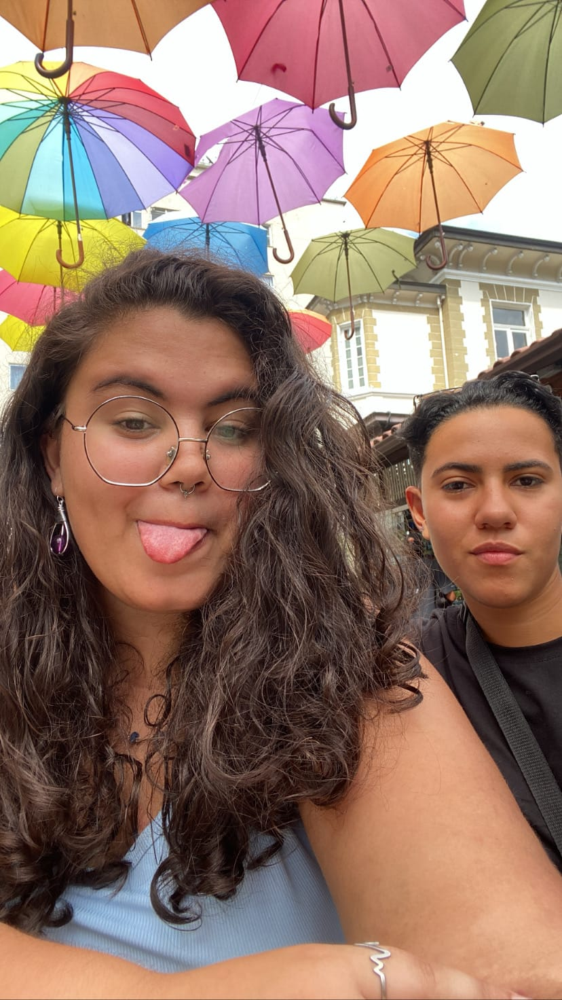
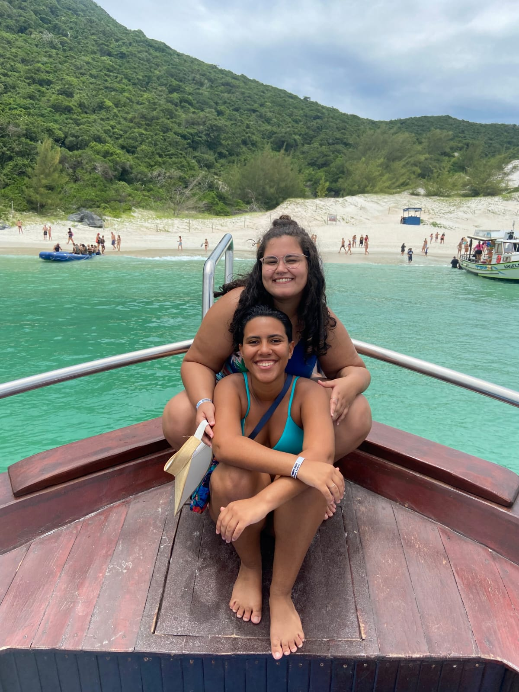
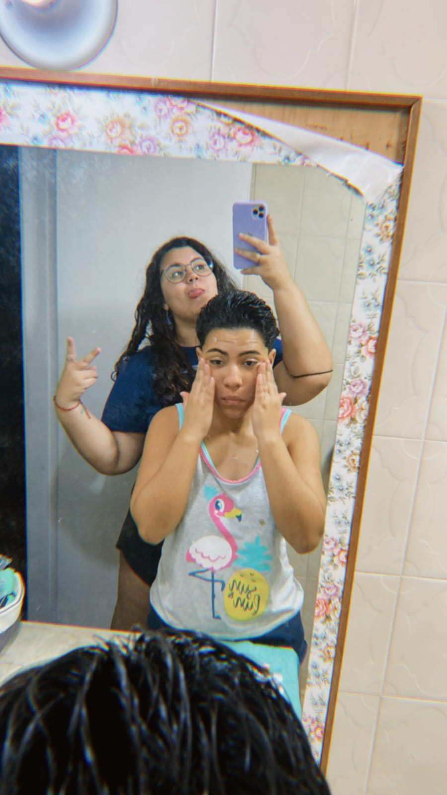

# README
<!DOCTYPE html>
<html lang="pt-BR">
<head>
    <meta charset="UTF-8">
    <title>Para minha Namorada</title>
    <link rel="stylesheet" href="style.css">
    
        
  </head>
  <body>
    

      <h1>Para minha MULHER </h1> 
      

         
Você é a pessoa mais incrível que eu já conheci. Obrigada por estar ao meu lado.   Imagem 1

         
         
Eu te amo mesmo você sendo insuportavel mas sei que também não sou fácil kkkkkkkkkk.   Imagem 2

         
        
Eu amo a sua risada, o seu sorriso, a sua voz. Tudo em você me faz feliz.  Imagem 3

        
        
Obrigado por me fazer sentir amada e por me fazer ver o mundo de uma forma mais bonita.  Imagem 4

        
        
Você é a minha melhor amiga e o meu amor. Eu te amo muito!   Imagem 5

        
         
Eu não consigo imaginar a minha vida sem você.   Imagem 6

         
        
Eu quero passar o resto da minha vida ao seu lado.   Imagem 7

        
        
Obrigrada por viajar comigo para a praia sempre!! Mesmo que você odeia minha musa do inverno.  Imagem 8

        
        
Amo quando você vai na minha onda.   Imagem 9

        
        
Vampira mais sexy simplismente não existeeee!   Imagem 10 

        
        
Meus dias com você são tão leves que esqueço do mundo ao meu redor.   Imagem 12 

        
        
Feliz nosso dia! 2.9 não é pra qualquer um kkkkkkkk.   Imagem 13

        
      

      
 
      

    

  </body>
</html>
